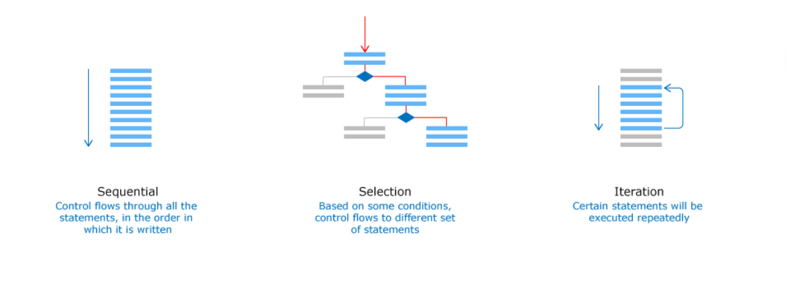

# Programming Fundamentals using Python Part-1


## Importance of programming

In this digital era, the knowledge of programming is essential to bring innovation and change. To create value with your own ideas you need know coding.   Programming has become basic literacy for the 21st century.

## Understanding programming by considering scenarios at airport

In the airport there are many flights landing and taking off. Unlike road traffic, the flights don’t have direct information of other flights around them. The Air Traffic Control (ATC) at the ground gives instructions to each flight on what it should do.

Similarly, instructions are provided to computer to accomplish specific tasks. Such instructions are known as program and the act of creating a program is known as programming.

## Three aspects of solving a problem - input, process and output


## Algorithm, pseudo-code and flowchart

Algorithm should be represented from the mental thoughts into a form which others can understand. There are primarily two ways of representing an algorithm:

    Flow chart: Diagrammatic way of representing the algorithm.
    Pseudo-code: Representing the algorithm between a program and normal English.

For example, here is a pseudo-code and a flowchart.


## Python- data-types, variables and its dimensions


  Python programming language supports the following datatypes:

  | Category | Python |
  |----|----|
  | Numeric | int, long, complex |
  | Numeric with decimal point | float |
  | Alphanumeric | string |
  | Boolean | boolean |

  A variable is a name that is assigned to a value. It is done so that we can refer to that value at some later point in the program. We have seen that a variable will have a name, value, type and it will occupy memory. Apart from these, it has two more dimensions – scope and lifetime. Thus we can say that any variable will have the following six dimensions.

  

## Dynamic and Static Typing

Languages like Python are dynamically typed whereas C,Go etc are statically typed.

Dynamic Typing is a technique in some languages where depending on how a value is used, the data type of the variable is dynamically and automatically assigned. Consider the below code in Python,

num=65 #Line 1

num="A" #Line 2

 
In Line 1, variable num is considered to be of type int and in Line 2, its type is reassigned to String.

Static Typing is used in some languages where the data type has to be declared before a variable is used. Consider the below code in Go,

var num int=65; //Line 1

num="A"; //Line 2

var name string = "A"; //Line3


Here, Line 1 is a valid statement which declares a variable num of type int. But Line 2 is invalid as we cannot assign a string value to variable num which is already declared to be of type int. Line 3 is a valid statement where name is declared and used as a string.

## Precedence of Operators

What do you think is the output of  5+4*9%(3+1)/6-1?
How do you think the result of this expression is computed?

It is done based on the precedence of the operators. Precedence of an operator can be identified based on the rule - BODMAS. Brackets followed by Orders (Powers, Roots), followed by modulo, Division and Multiplication, followed by Addition and Subtraction.

- Brackets have the highest precedence followed by orders.

- Modulo, Division and Multiplication have the same precedence. Hence if all appear in an expression, they are evaluated from Left to Right.

- Addition and Subtraction have the same precedence. Hence if both appear in an expression, they are evaluated from Left to Right.


## Implicit & Explicit Type Conversion

Take a look at the below code:

num=1 + 1.0
The result is 2.0 !

Here we were actually expecting the output as 2 but Python automatically converted 1 into a float and added with 1.0. This is known as implicit conversion.
Implicit conversions are dangerous as one may encounter unexpected result.

Take a look at the below code:

num=1 + int(1.0)
The result will be 2 !

If we want the output as 2, then we have to explicitly convert the float 1.0 into integer 1. This is known as explicit conversion. Explicit conversion involves mentioning the data type within brackets explicitly.

Programming languages define their own rule for implicit and explicit conversions and these rules will change from language to language.

## Coding Standards- google style guide, snake_case pattern in python, importance of placing comments and use meaningful variable names

Coding standards are the set of guidelines that can be used to enhance the readability and clarity of the program and make it easy to debug and maintain the program.


As per Google style guide , variable names in Python should be written as var_name.

The pattern followed in Python is known as snake_case.

Apart from this, it is important to place comments wherever possible to explain code and use meaningful variable names. Comment is an explanation provided in the code which makes it easier to understand for a person who is going through the code.

## Escape Sequences in python

Escape sequence is a sequence of characters that have special meaning when enclosed in a string. It always begins with a backslash(\).
- Formatting Output-Activity
- Selection and Nested Selection in Pseudo-code
- Iteration in Pseudo-code


## Basics of Functions

A function is a block of code that performs a particular task. In python, functions are declared using the keyword def.


## Flow of Execution in Functions

Analyze this code to observe :

- Function call

- Actual arguments being copied to formal arguments

- Execution of function body

- Return from function

```python
observe1="What's happening!!"

def passport_check(passport_no):
    observe4="actual copied to formal"
    observe5="func. execution starts"
    if(len(passport_no)==8):
        if(passport_no[0]>="A" and passport_no[0]<="Z"):
            status="valid"
        else:
            status="invalid"
    else:
        status= "invalid"
    observe6="func. execution ends"
    return status

observe2="function with formal arg."
observe3="calling with actual arg."
passport_status=passport_check("M9993471")

print("Passport is",passport_status)
#observe1,2,3,4,5,6 are temporary variables used to explain this concept
```
## 'return' in Function


  
## Function Invocation


## Control Structures
Recall the different control structures using which the programmer specifies the order of execution of statements. The commonly used control structures in programming are:



## Selection Control Structures

During check-in process in an airport, the luggage weight of each passenger is checked and in case of over-weight, they are asked to pay for extra luggage. 
Below Python program represents the check-in process. Go through it and guess the output. 
Assume luggage weight is always positive. 
```python
ticket_status="Confirmed"
luggage_weight=32
weight_limit=30  #Weight limit for the airline
extra_luggage_charge=0
if(ticket_status=="Confirmed"):
    if(luggage_weight>0 and luggage_weight<=weight_limit):
        print("Check-in cleared")
    elif(luggage_weight<=(weight_limit+10)):
        extra_luggage_charge=300*(luggage_weight-weight_limit)
    else:
        extra_luggage_charge=500*(luggage_weight-weight_limit)
    if(extra_luggage_charge>0):
        print("Extra luggage charge is Rs.", extra_luggage_charge)
        print("Please make the payment to clear check-in")
else:
    print("Sorry, ticket is not confirmed")
```
The program you have seen uses various decision control statements for implementing the logic. Let’s explore it one by one using scenarios related to check-in process.

One of the first steps during check-in process is checking the passport status. Consider the below program written for that. 
```python
passenger_name="Chan"
passport_status="valid"
if(passport_status=="valid"):
    print("Airport security cleared")
else:
    print("Invalid passport")
```
The conditional statement used in this program is known as if-else statement.

The next step in check-in process is checking the luggage weight.
```python
luggage_weight=30
weight_limit=30  #Weight limit for the airline
extra_luggage_charge=0
if(luggage_weight>0 and luggage_weight<=weight_limit):
    print("Check-in cleared")
elif(luggage_weight<=(weight_limit+10)):
    extra_luggage_charge=300*(luggage_weight-weight_limit)
else:
    extra_luggage_charge=500*(luggage_weight-weight_limit)
if(extra_luggage_charge>0):
    print("Extra luggage charge is Rs.", extra_luggage_charge)
    print("Please make the payment to clear check-in")
```
The conditional statement in this program is known as the else if ladder . The conditions are evaluated from top of the ladder downwards. As soon as a true condition is encountered, the statement associated with it is executed. The remaining condition checks in the ladder will be skipped.

Let’s combine the luggage check-in process with ticket validation. Ticket validation happens first followed by luggage check-in.
```python
ticket_status="Confirmed"
luggage_weight=32
weight_limit=30  #Weight limit for the airline
extra_luggage_charge=0
if(ticket_status=="Confirmed"):
    if(luggage_weight>0 and luggage_weight<=weight_limit):
        print("Check-in cleared")
    elif(luggage_weight<=(weight_limit+10)):
        extra_luggage_charge=300*(luggage_weight-weight_limit)
    else:
        extra_luggage_charge=500*(luggage_weight-weight_limit)
    if(extra_luggage_charge>0):
        print("Extra luggage charge is Rs.", extra_luggage_charge)
        print("Please make the payment to clear check-in")
else:
    print("Sorry, ticket is not confirmed")

```
The conditional statement written in this program is known as nested if statement. In this case, an if statement is written within another if statement. Similarly, any decision logic can also be written within an else statement.

`Problem Statement`

Write a python program that displays a message as follows for a given number:

1. If it is a multiple of three, display "Zip"
2. If it is a multiple of five, display "Zap".
3. If it is a multiple of both three and five, display "Zoom".
4. If it does not satisfy any of the above given conditions, display "Invalid".

`Solution`
```python
def display(num):
    if(num%3 == 0 and num%5 == 0):
       message="Zoom"
    elif num%5 == 0:
       message="Zap"
    elif num%3 == 0:
       message="Zip"
    else:
       message="Invalid"
    #write your logic here
    return message

#Provide different values for num and test your program
message=display(9)
print(message)
```

